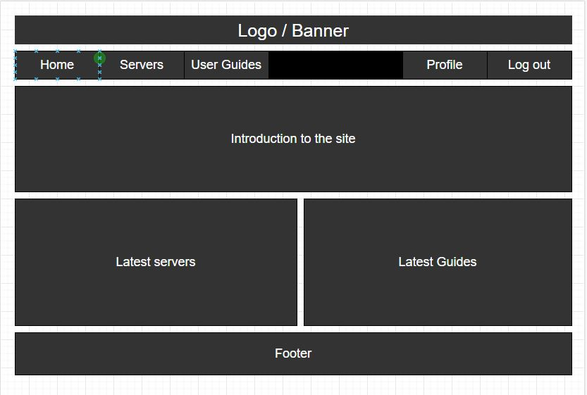
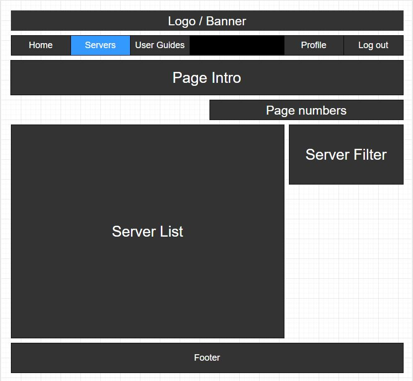
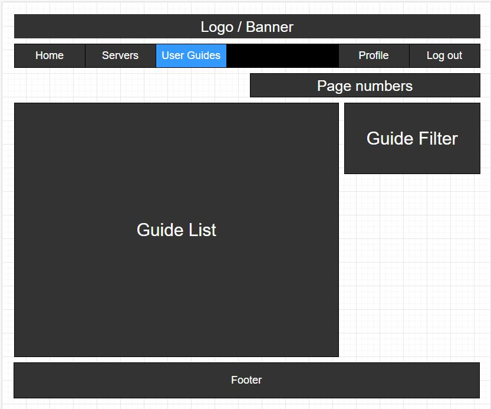
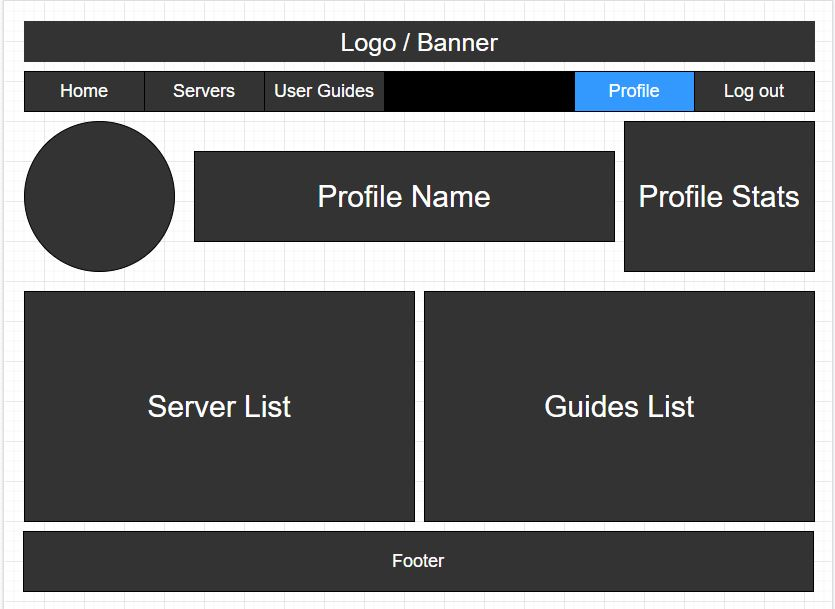

# Cadius Community

## Project Goals

The Cadius Community site is deisgn to allow users to advertise their game servers. Users will also able to share their favourite screenshots with other users having the ability to comment on them.

To visit the live version of the site (hosted by Heroku) click [here](http://cadius-community.herokuapp.com/)

The site will be design using the React system. This allows me to design a well structure architecture and allows for the reuse of components across the site. For example this site will use a component called "CurrentUserContext", this checks for the current user logged in. This can then be reused anywhere on the site without having to duplicate code.

## Project Board

During this project I have used an Agile methodology and been using the project section of Github to manage and track my User Stories progression.

To view the Project Kanban board click [here](https://github.com/users/robcole-dev/projects/1/views/1)

## User Stories

- User Story: Navigation - As a User I can view a navbar from every page so I can navigate easily between pages
- User Story: Pagination - As a User I can navigate through pages so I can view content seamlessly without page refresh
- User Story: Authentication - Site Sign Up - As a User I can create a new account so I can access all the features for signed in users
- User Story: Authentication - Site Sign In - As a User I can sign in to the site so I can access the functionality for a logged in user
- User Story: Authentication - Logged in User - As a User I can tell if i am logged in or not so I can log in if required
- User Story: Access Token Refresh - As a User I can maintain my logged-in status until i choose to log out so that my user experience is not compromised
- User Story: Profile Picture - As a User I can view user's profile pictures so I can easily identify users of the site
- User Story: Create a Server Post - As a Logged in User I can create a server post so I can share my server info with the community
- User Story: View a Server - As a User I can view the server details so I can learn more about the server
- User Story: Server Page - As a logged in user I can view a servers details so I can see the server stats and more details about the server
- User Story: Edit a server - As a server owner I can edit my servers details so I can make corrections or update any details that may have changed
- User Story: Infinite scroll - As a user I can keep scrolling through the tutorials and guides on the site, that are loaded for me automatically so that I don't have to click on "next page" etc
- User Story: Screenshot page - As a logged in user I can view the screenshots page so I can read the comments about the screenshot
- User Story: Edit a Screenshot Post - As a screenshot owner I can edit my screenshot post so I can make corrections or update the screenshot after it was created
- User Story: Create a comment - As a logged in user I can add comments to a screenshot so that I can share my thoughts about the screenshot
- User Story: Edit a comment - As an owner of a comment I can edit my comment so that I can fix or update my existing comment
- User Story: Delete comments - As an owner of a comment I can delete my comment so that I can control removal of my comment from the application
- User Story: Profile Page - As a User I can view other users profiles so I can see what tutorials or servers they have created
- User Story: Edit profile - As a logged in user I can edit my profile so I can change my profile picture or bio
- User Story: Update login details - As a logged in user I can update my username and password so I can keep my information upto date and my profile secure

## UX

### Wireframes and Designs

Below are a couple of screenshots of flowcharts created for this project.

## Features 

Below are a list of key features and future features.

### Existing Features

- __Index Page__
    - When the site first loads users are presented with a greating message to the site and a short description about the site

- __Server Page__
    - This page lists all the servers users have posted on the site. Logged in users are then able to click on a server and find out more details.

- __Screenshot Page__
    - This page lists all the screenshots users have posted on the site. Logged in users are able to click the screenshot and view the comments.

- __Profile Page__
    - This page displays the users profile. It lists the users screenshots and servers if they have posted any.

### Features Left to implement

- __Emojis__
    - This feature will allow user to leave feedback in a fun and exciting way

- __Server Rating__
    - Currently the site only allows for users to add and view servers. This feature would expand on that and give users the ability to rate a server based on a 5 star system.

## Technologies Used

During development of the site a number of programs and web based applications were used. You can find a list of the below:

[DrawIO](https://drawio-app.com/) - Used to create the Entity Relationship Diagram

[Balsamiq Wireframse](https://balsamiq.com/wireframes/) - Used to create wireframes of site

[Github](https://github.com/) - Used to host the project

[Gitpod](https://www.gitpod.io/) - Used as a cloud based IDE to code the project

[GIT](https://en.wikipedia.org/wiki/Git) - Used for version control

[Heroku](https://www.heroku.com/) - Used to host the deployed site

Plugins that was used to develop this site are:

[React Bootstrap](https://react-bootstrap.github.io/) - Used to apply style to the project

[React](https://reactjs.org/) - Used for the project framework

Code that was used to develop this site are:

[JavaScript](https://www.javascript.com/) - Used for backend coding

[HTML5](https://en.wikipedia.org/wiki/HTML5) - Used for front end styling

[CSS3](https://en.wikipedia.org/wiki/CSS) - Used for custom styling not covered by bootstrap

## Testing

For all testing, please refer to the [TESTING.md](TESTING.md) file.

## Deployment

The site was deployed to Heroku. The steps to deploy are as follows: 

- Login / signup to [Heroku](https://id.heroku.com/login)
- On the dasboard, once logged in, click New and then click Create new app
- Give the App a name and select your region, then click create app
- Click deploy from the menu at the top, then click github.
- enter the repositry name and click search. if found the repositry will appear below, click connect.
- once the site is deployed click open app and copy the url from the address bar.
- Navigate to the DRF deployed site and open the Config Vars.
- creat a key called "CLIENT_ORIGIN" and paste the url you copied into the value, remove the last forward slash

[Link to deployed site](http://cadius-community.herokuapp.com/)

### Local Deployment

if you would like to make a clone of this repository, you can type the following command in your iDE terminal:

- `git clone https://github.com/robcole-dev/cadius-community.git`

Alternatively, if using Git pod, you can click below to create your own workspace using this repository.

## Credits 

### Content

- The icons in the footer were taken from [Font Awesome](https://fontawesome.com/)

### Acknowledgments

- Aura Cole (My Wife)
- The community over on Code Institute's Slack
- Tutor Support at Code Institute