# Testing

Below is a list of test that have been carried out with screenshots.

## Code Validation
__Code Validation__

__CSS__
- Full Site

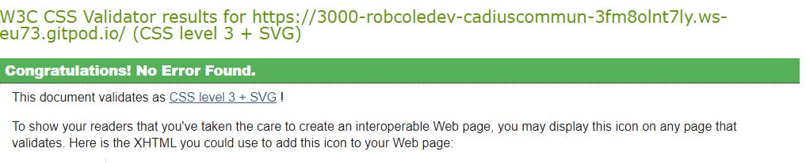

- Asset

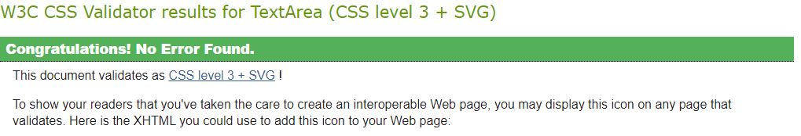

- Button

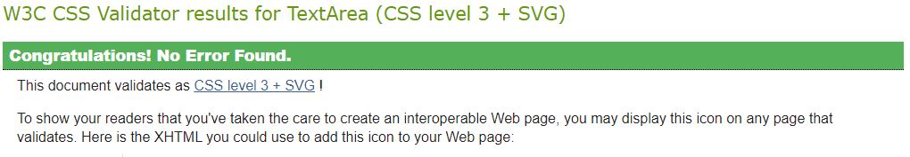

- Comment

- CommentCreatEditForm

- NavBar

- ProfileImage

- Screenshot

- Server

- ServerAddEdit

- ServersPage

- SignInUpForm

__JavaScript__

No errors were returned when passing throught the offical PEP8 Validation

__api Components__
- AxiosDefaults

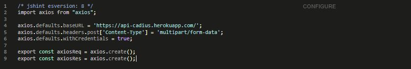

__Components__
- Asset

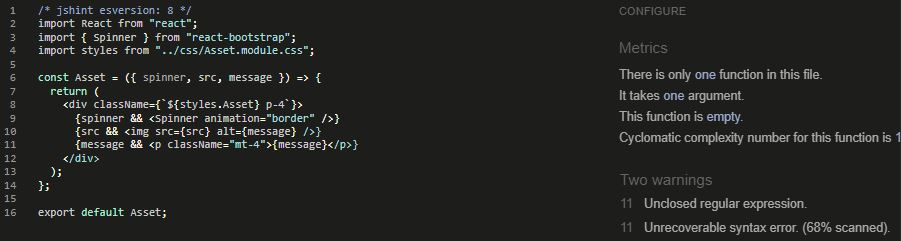

- Navbar

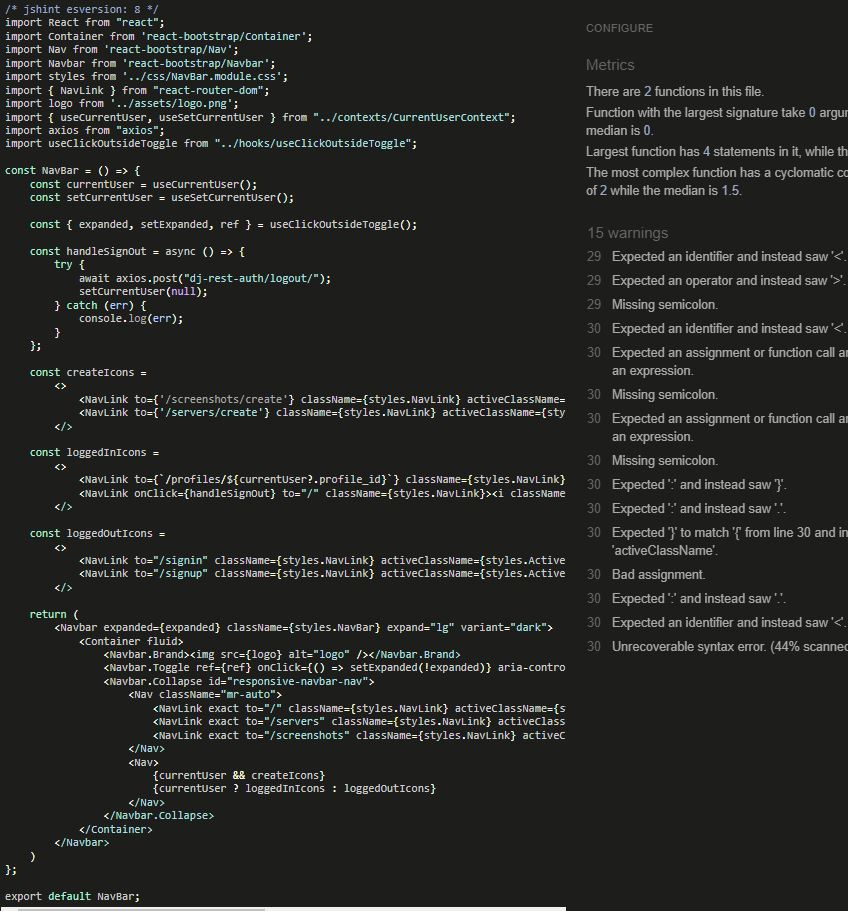

- ProfileImage

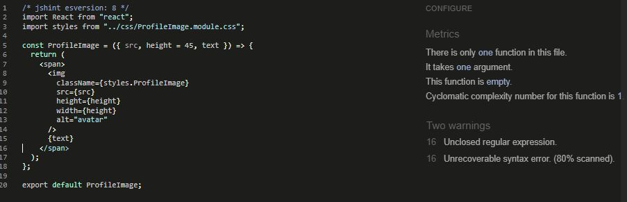

__Contexts__
- CurrentuserContext

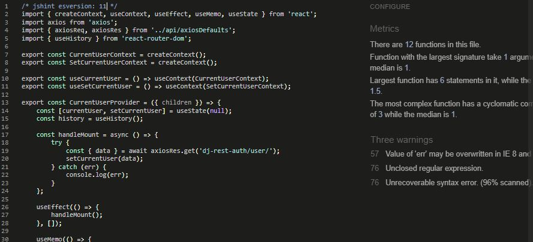

__Hooks__
- useClickOutsideToggle

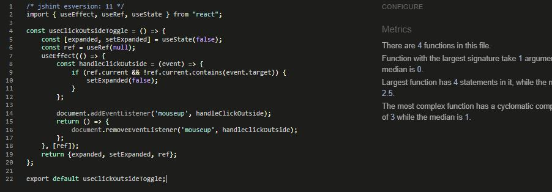

__Auth Pages__
- SignInForm

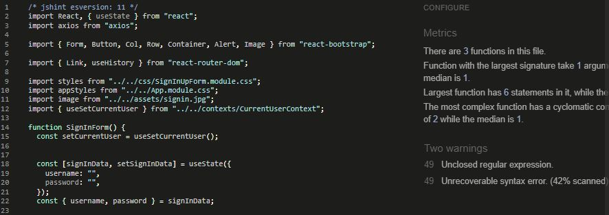
- SignUpForm

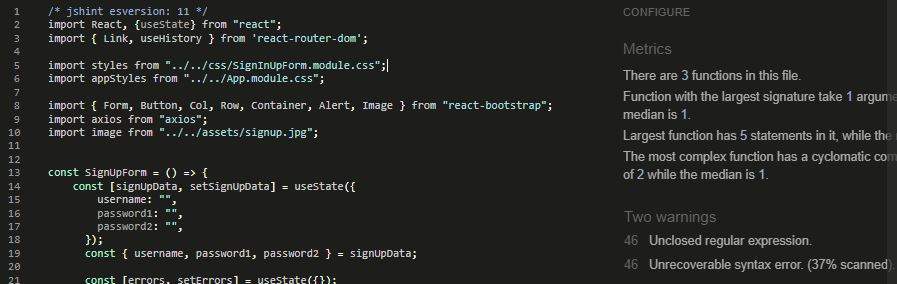

__Comments Pages__
- Comment

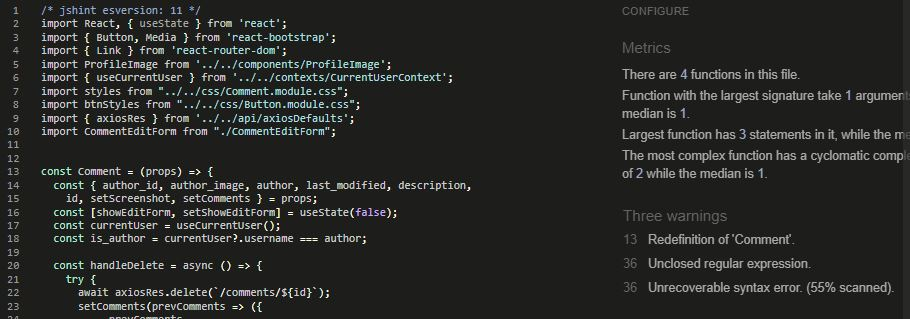

- CommentCreateForm

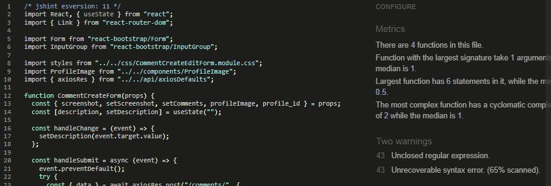

- CommentEditForm

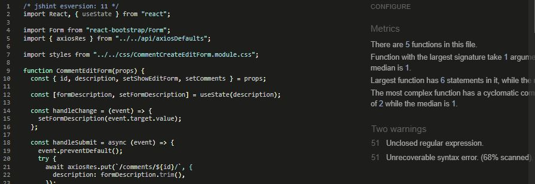

__Screenshots__
- Screenshot

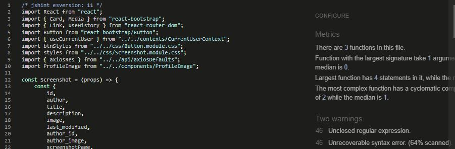

- ScreenshotCreateForm

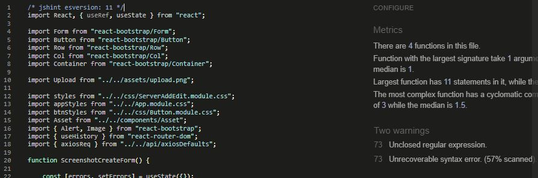

- ScreenshotEditForm

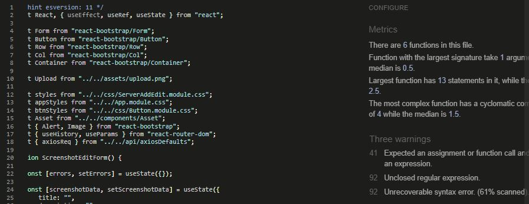

- ScreenshotPage

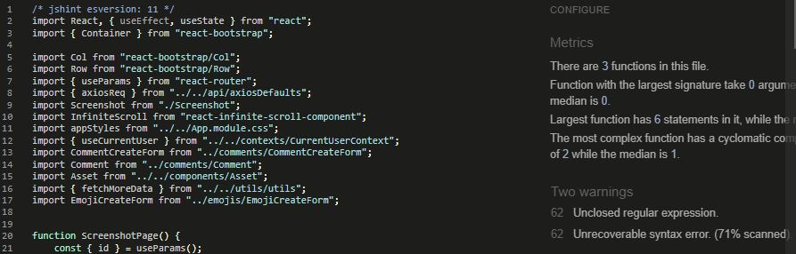

- ScreenshotsPage

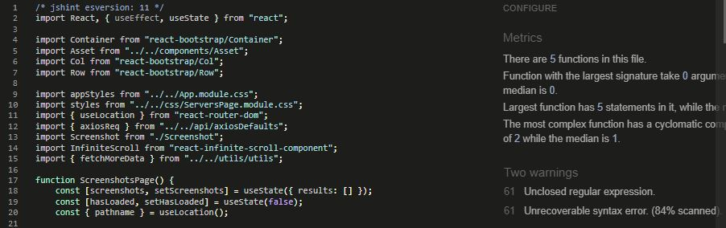

Servers
- Server

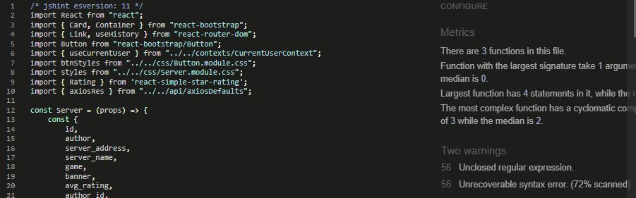

- ServerCreateForm

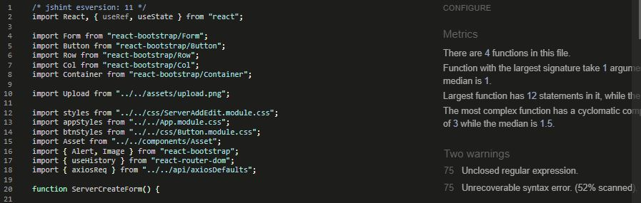

- ServerEditPage

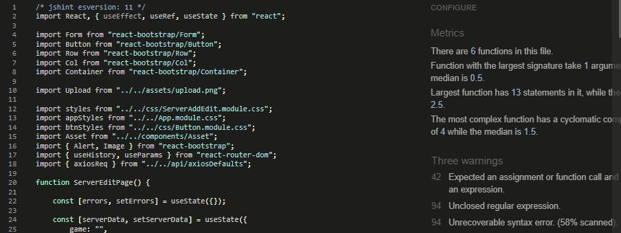

- ServerPage

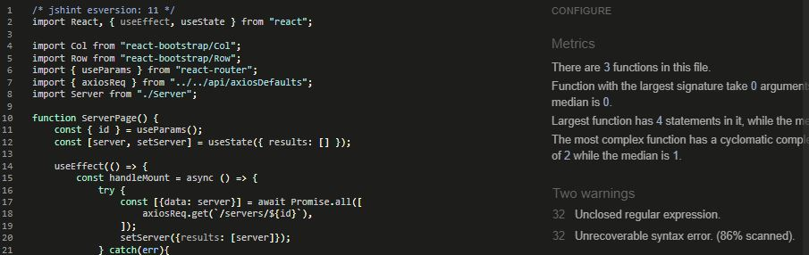

- ServersPage

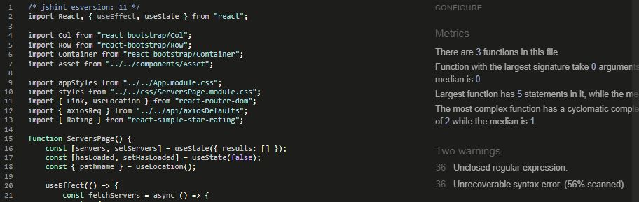

__Utils__
- Utils

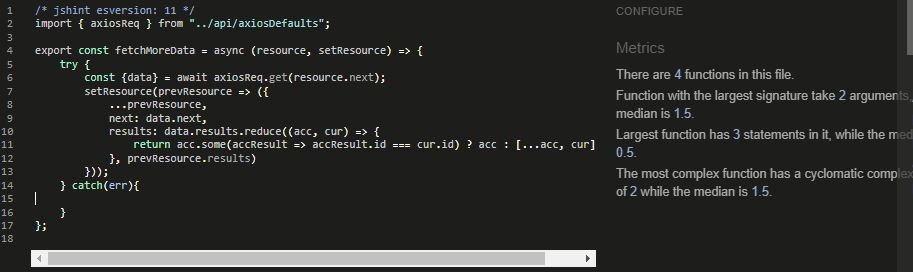

__App__
- App

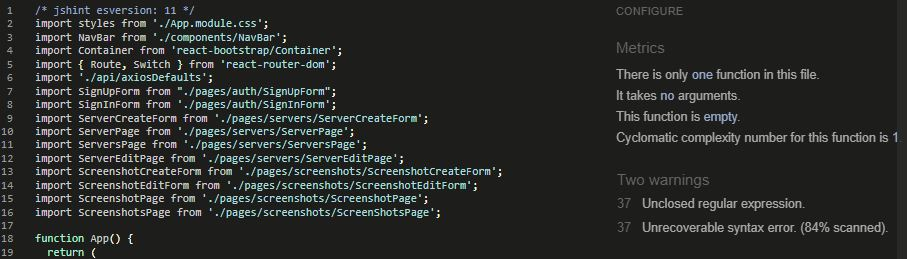

__Manual Testing__
- Testing of Navbar

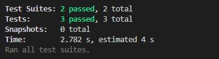

## Fixed Bugs
During development, I ran into some bugs, errors, and issues which I have successfully debugged and troubleshot.

You can find them on the issues tracker on the repository. [Here](https://github.com/robcole-dev/cadius-community/issues?q=is%3Aissue+is%3Aclosed)

- Bug Report: Mobile Navigation not collapsing (Issue [#24](https://github.com/robcole-dev/cadius-community/issues/24))

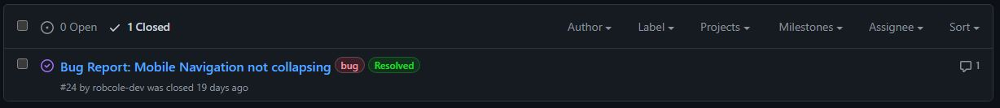

## Unfixed Bugs

Currently there are no bugs that I am aware of.
